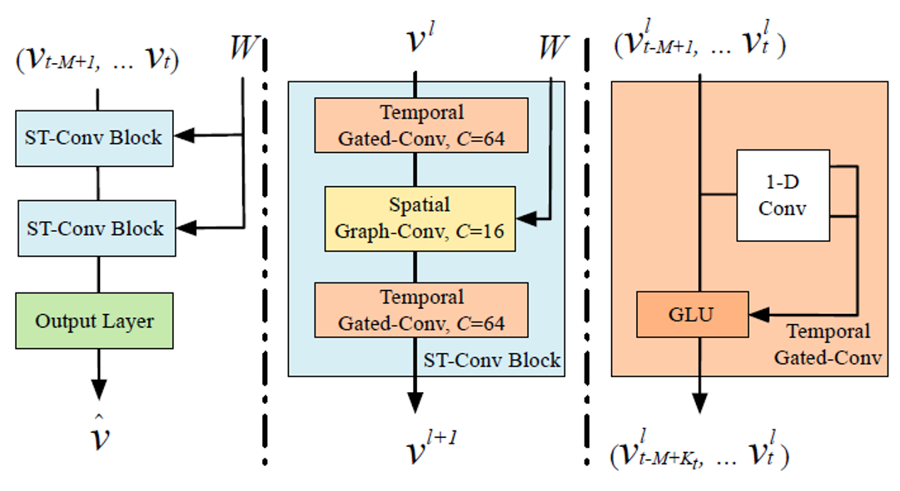

## Forecast Traffic Jam

### Introduction

Intelligent transportation system (ITS) is an essential component of intelligent city, especially in modern cities. In recent years, many researchers have studied in the field of traffic flow detection or traffic flow prediction. However, previous researchers have often used historical traffic data from years ago or hardware installed on the ground to obtain traffic flow information.

Since people often use sections to show whether a road is congested or not, rather than a latitude and longitude coordinates or a certain point, we put forward a new figure convolution model based on the edge of space and time, called edge-based spatial temporal graph convolution networks(EB-STGCN).

### Model

The framework STGCN consists of two spatio-temporal convolution blocks and a fully connected output layer in the end. Each spatio-temporal convolution block contains two temporal gated convolution layers and one spatial graph convolution in the middle.

Based on this framework, we make some improvement. In STGCN, the adjacent matrix is computed based on the distances among points in the traffic network. As this formula shows, the matrix is a function of straight-line distances, if the distance is larger than threshold, the weight is set to 0. This matrix does not encompass the logical connections between each road segment.

We propose another method to generate graph matrix, which is based on edge – road segment. Each weight in the adjacent matrix represents the topological relationship between two road segments. If there’s only one turn between two road, the weight is 1, if more turns are needed, the weight is less than 1. Our matrix shows the topological connections between two road, thus closer to the real situation.

### Data

In previous work, the traffic data is recorded by hardware, such as cameras or loop detector. Those methods need extra construction in hardware equipment, which is expensive for large scale implement. Thus, we use the traffic api from internet map service provider Gaode. We built the database using MongoDB and obtained data from Gaode api.

We have three generation of traffic dataset, and use the final one to do experiment. In the first dataset, we choose 50 distribute points in Shanghai, and get weather data from Moji api, but we found that in this dataset, there’s little relationship between two points, and it’s hard to integrate weather data to our dataset. In the second dataset, we choose 50 points concentrated upon Shanghai Railway station, but we found that due to the defects of Gaode api, some points on one road segment have exactly the same data, which causes redundancy.

Finally, we built the third dataset, which includes 43 road segments concentrated upon Shanghai Railway station, each time step is 1 minute. We use this dataset in further experiment.

Although the data cleaning process is done by scrips automatically, we still spent lots of time on data cleaning. The data cleaning scrips mainly fill vacancy data and eliminate duplicate data. 

### Experiment

We completed the experiments on the dataset. We applied LSTM, STGCN, and out EBSTGCN respectively, the result is as follows.

To measure and evaluate the performance of different methods, mean absolute percentage error, mean absolute error and root mean square error are adopted. Previous work has already proved that deep learning methods such as FC-LSTM and STGCN have better performance than traditional methods such as history average and ARIMA, so we only compare the most efficient methods in our experiment. As you can see, our method has slight improvement on the performance. For example, as for 15 minutes prediction, mean absolute error reduces about 1% percent.

### Innovation

First, the adjacent matrix is based on road segment, not coordinate points.
This means our results conform drivers’ habits. Drivers generally analyze the congestion situation by road segments, not points. When your family stuck in the traffic jam, your father may always say “This road is blocked!” rather than “This point is blocked!”
Second, the weight of adjacent matrix is based on the topological relation of road segments, rather than the distance between points.  Thus, our method considers the direction and turning of the road section, this makes our method more reasonable.
